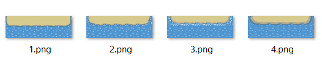
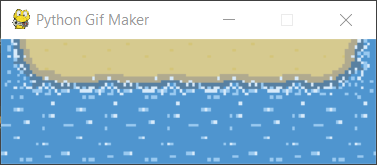
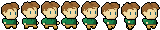
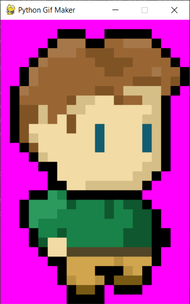
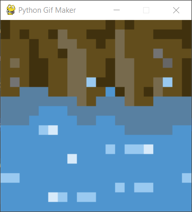
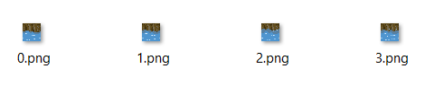

# Python GIF Maker 🐍

[](https://www.python.org/downloads/release/python-3100/)

Create GIF files based on **images** series or **tileset**. Using [Pillow](https://pillow.readthedocs.io/en/stable/) and [Pygame](https://www.pygame.org/).

## Series of images based gif

Source PNG or JPG files are stored in the directory.

Run command for help:

```shell
python pgm.py series -h
```

```text
  -h, --help            show this help message and exit
  -d DURATION, --duration DURATION
                        Interval of animation [s]
  -p PREVIEW_WIDTH, --preview_width PREVIEW_WIDTH
                        Preview width, no antialiasing, -1 to turn off
  -o OUTPUT_NAME, --output_name OUTPUT_NAME
                        Name, .gif can be omitted
  -t, --temp_save       Save frames in 'frames' directory
```
Content of the test_series directory:



```shell
python pgm.py series test_series/ -d 4 -p 300
```
The animated preview:



Final result:


## Tileset based gif

Source file is the tileset image consisting of grid of tiles with the same width and height.

Run command for help:

```shell
python pgm.py tileset -h
```

Parameters not listed in series mode:

```text
  ...
  -g GRIDSIZE GRIDSIZE, --gridsize GRIDSIZE GRIDSIZE
                        Number of: columns and rows
  -s START_INDEX, --start_index START_INDEX
                        Index counting from 0 in rows
  -f FRAMES_COUNT, --frames_count FRAMES_COUNT
                        Total number of frames
  -b {RED,GREEN,BLUE,WHITE,BLACK,MAGENTA}, --bg_color {RED,GREEN,BLUE,WHITE,BLACK,MAGENTA}
                        Replacement for transparency
```

### With transparency

If source images have transparency, it will be replaced with bg_color.

The source tileset consisting of 8 columns and 1 row. Each tile is 30x20px.



```shell
python pgm.py tileset test_tileset/player.png -d 0.5 -g 8 1 -s 0 -f 8 -p 300
```

The animated preview:



Final result:


### Without transparency

The source tileset consisting of 8 columns and 2 row. Each tile is 20x20px.


The animated preview:



```shell
python pgm.py tileset test_tileset/floor.png -d 4 -g 8 2 -s 8 -f 4 -t -p 300
```

Final result:


Using **-t** parameter resulting frames are stored in frames **directory**:



## Installation

Download using git then make venv, install requirements and run!

```shell
git clone https://github.com/Gieneq/PythonGIFMaker
cd PythonGIFMaker
python -m venv venv
```

Activationg venv depending on OS. On Windows:

```shell
venv\Scripts\activate
```

On Linux:
```shell
source venv/bin/activate
```

```shell
pip install --upgrade pip
pip install -r requrements.txt
```

Done! ⭐